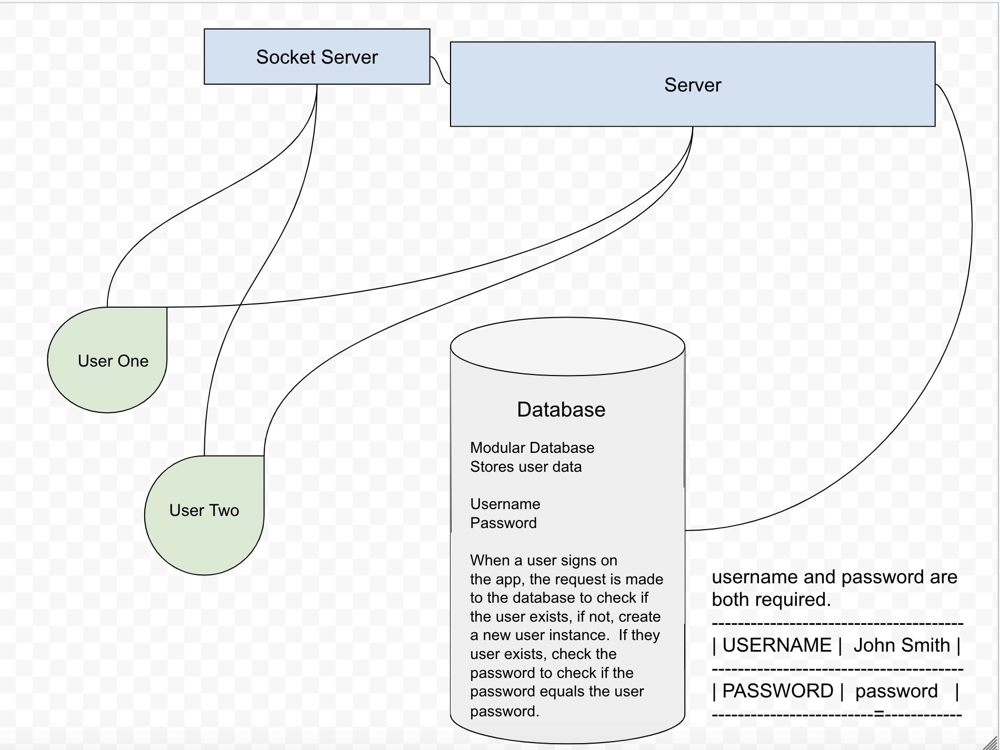
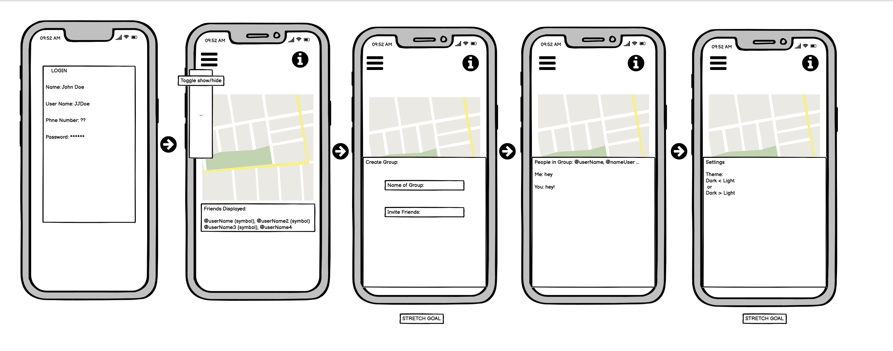

# trackChat

### Version:
1.0.0

### Contributors:
* Christopher Hamersly, Developer
* Cas Ibrahim, Developer
* Reagan Roberts, Developer
* Joshua Williams, Developer

## Table of Contents
  - [Overview](#overview)
  - [Project Management Board](#project-management-board)
  - [Software Requirements](#software-requirements)
  - [Installation](#installation)
  - [Deployment](#deployment)
  - [UML Data Model](#uml-data-model)
  - [Wireframe](#wireframe)
  - [Approach to Testing](#approach-to-testing)
  - [License](#license)
  - [Acknowledgements / Resources](#resources)

### Overview

--project overview here--

## Project Management Board
This project utilizes Trello for project management. You can visit this board by clicking the link below.
[Workflow Board](https://trello.com/b/ghk1xrIa/401finalproject)

## Software Requirements
Please visit this link to view the [Software Requirements](./requirements.md)

## Installation
First clone down a copy of the repository from: [Repo Link](https://github.com/trackChat/trackChat).

## Deployment

## UML Data Model

## Wireframe

## Approach to Testing

## License

## Resources
