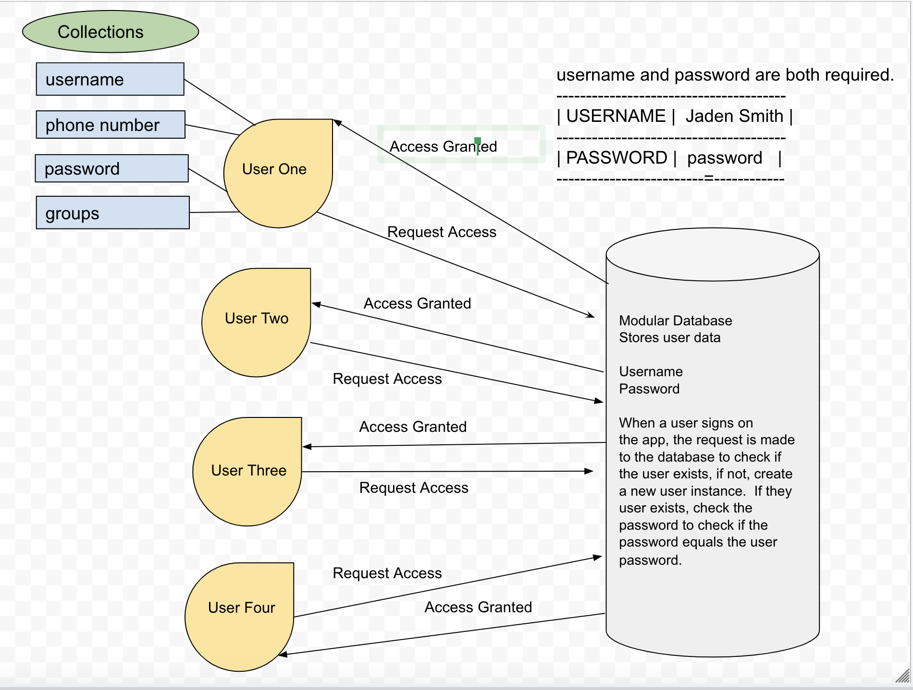

# trackChat

### Version:
1.0.0

### Contributors:
* Christopher Hamersly, Developer
* Cas Ibrahim, Developer
* Reagan Roberts, Developer
* Joshua Williams, Developer

## Table of Contents
  - [Overview](#overview)
  - [Project Management Board](#project-management-board)
  - [Software Requirements](#software-requirements)
  - [Installation](#installation)
  - [Deployment](#deployment)
  - [Data Models](#uml-data-model)
  - [Wireframe](#wireframe)
  - [Approach to Testing](#approach-to-testing)
  - [License](#license)
  - [Acknowledgements / Resources](#resources)

### Overview

A simple and easy-to-use app which:
* serves as a centralized view to locate and communicate with a group of people, in order to enable safe travel
* Users have the ability to chat with other users in the app
*  Users have the ability to create a username and password which will persist in a database. 
* Users have the ability to send an alert which will be broadcast to users of the app, detailing the user and location of the user in distress. 

## Project Management Board
This project utilizes Trello for project management. You can visit this board by clicking the link below.
[Workflow Board](https://trello.com/b/ghk1xrIa/401finalproject)

## Software Requirements
Please visit this link to view the [Software Requirements](./requirements.md)

## Installation
1. Clone this repository to your local machine: [Repo Link](https://github.com/trackChat/trackChat)
1. Run the following command in your terminal to install all of the dependencies. 
```
npm i
```
3. Next create an expo app by running 
```
expo init trackChat
```
4. Navigate to the project directory by using 
```
cd trackChat
```
5. Run the following command to start the app on your local machine
```
expo start
```
6. Scan the QR code with your camera, and run the app from your phone. 


## Deployment

## Data Models


## Data Flow
* Upon visiting the app for the first time, a new user will create a user instance, that will be populated in the database. 
* A returning user will use the login option, which sends data to the database to do a check for correct user information.
* If the information for the user matches a user in the database, the username will be diplayed for the user throughout the app.  
* If the information the user inputted does not match the database, the user will be prompted to reenter their credentials. 
* When entering the app, the user will trigger a map query, and the users current location, and other app users will be displayed on map page. 
*  The map will update the users location every 3 seconds, and will reset the users position, using latititude and longitude. 
*  When a user sends a chat, the chat is being sent over a socket, to our deployed server, and being broadcast to all of the users of the app. 
* When a user sends an SOS, the sos message is send over a socket, to our deployed server, and will be broadcast to all users of the app. 
*  When a user logs out of the app the socket to the server is closed, and deleted from the socket list, and the users location is no longer rendered. 
*  Data is persisted by using a mongo database. 


## Overall Project Schema
```
username: ' ',
password: ' ',
color: type: ' ',
friends: type: ' ',
pendingRequest: ' ',
email: ' ',
role: ' ',
```


## Wireframe


## Approach to Testing

## License


## Resources
1. [React Native Documentation](https://reactnative.dev/)
1. [Expo Documentation](https://docs.expo.io/get-started/create-a-new-app/)
1. [React Native Cheat Sheet](https://github.com/vhpoet/react-native-styling-cheat-sheet#text)
1. [React Native Font Resource](https://github.com/react-native-training/react-native-fonts)

## Contributors Github Repositories
* [Christopher Hamersly](https://github.com/christopherhamersly)
* [Cas Ibrahim](https://github.com/mamacas)
* [Reagan Roberts](https://github.com/Rearo43)
* [Joshua Williams](https://github.com/jswill88)


